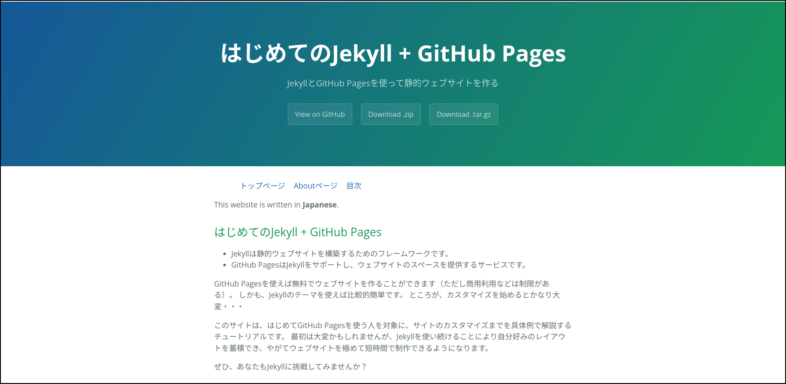

この章では、Caymanのレイアウトを説明します。
ここでCaymanを使うのは、あくまでテーマの一例としてで、他のレイアウトとの優劣を問題にするものではありません。
加えて、一般的なレイアウトの仕組みも説明します。

以下の説明では、`index.md`（サイトの入口にあたるページ）を新たに作成し、そのファイルとレイアウトの関連を見ていきます。 

## レイアウトファイルの置き場

Jekyllではレイアウトファイルの置き場は`/_layouts`です。
ただし、最初のスラッシュはJekyllのソースファイルのトップディレクトリです。
Linuxのルートディレクトリではないので注意してください。

Caymanはgemで提供されるので、そのレイアウトはgemがおかれている場所の`_layouts`ディレクトリになります。

```
 bundle info jekyll-theme-cayman
  * jekyll-theme-cayman (0.2.0)
        Summary: Cayman is a Jekyll theme for GitHub Pages
        Homepage: https://github.com/pages-themes/cayman
        Path: /（gemのおいてあるディレクトリ）/jekyll-theme-cayman-0.2.0
        Reverse Dependencies: 
                github-pages (227) depends on jekyll-theme-cayman (= 0.2.0)
```

gemの`_layout`ディレクトリの`default.html`がCaymanのレイアウトを記述したファイルになります。
`default.html`はHTMLファイルですが、Liquidの記述も含まれています。

## レイアウトの構成

Caymanは次のようなレイアウト構成になっています。


- 上の青い部分が「ヘッダ」で、その中に「タイトル」「ディスクリプション」「ボタン」がある
- 「ボタン」はレポジトリへのリンクとZIP、TAR.GZのダウンロードの3つ
- 下の白い部分が「コンテンツ」

個々のファイルで変更できるのは「タイトル」「ディスクリプション」「コンテンツ」です。

#### タイトルとディスクリプション

タイトルとディスクリプションは`default.html`の19、203行目で記述されています。


```html
<h1 class="project-name">{{ page.title | default: site.title | default: site.github.repository_name }}</h1>
<h2 class="project-tagline">{{ page.description | default: site.description | default: site.github.project_tagline }}</h2>
```


HTMLに埋め込まれている`{{`と`}}`で囲まれている部分はLiquidというプログラミング言語です。
[LiquidのGItHubレポジトリ](https://github.com/Shopify/liquid)では、これを「テンプレート・エンジン」と呼んでいます。
`h1`タグのところがタイトルです。

```
page.title | default: site.title | default: site.github.repository_name 
```

- `page.title`はページのタイトル。
例えば、index.mdのフロントマターに`title: インデックスページ`と書かれていたとすると、その文字列「インデックスページ」が`page.title`に代入される。
それがなくて、コンテンツの最初が見出しの場合は、その見出しが`page.title`に代入される。
ページのタイトルがなければ、nilが代入される。
- `site.title`はサイトのタイトル。
例えば、`_config.yml`に`title: サンプルサイト`と書かれていたとすると、「サンプルサイト」が`site.title`に代入される。
- `site.github.repository_name`はGitHubのレポジトリーの名前。
ローカルでJekyllを動かすときには、`jekyll-github-metadata` gemがGitHubに問い合わせて情報を取得する。
- 縦棒`|`はフィルターと呼ばれているLiquidの構文で、左の式の値が右への入力になる。
これはシェル・スクリプトのパイプと似た機能である。
縦棒を「パイプ」ともいう。
また、左側の出力と右側の入力をつなげる機能も「パイプ」という。
- `default:` はフィルターの動作を規定するコマンドで、入力が空文字列、nil、falseのいずれかであればデフォルト値（`default:`の次に書かれている式）をとる。
それ以外であればパイプから入力された式を値とする。

これよりこのLiquidのフィルタは

- ページタイトルがあればページタイトルを出力
- ページタイトルがなくてサイトタイトルがあれば、サイトタイトルを出力
- ページタイトルもサイトタイトルもなければ、GitHubレポジトリ名を出力

となります。
同様にディスクリプションも

- ページディスクリプションがあればページディスクリプションを出力
- ページディスクリプションが無くてサイトディスクリプションがあれば、サイトディスクリプションを出力
- ページディスクリプションもサイトディスクリプションもなければ、GitHubレポジトリのディスクリプション（レポジトリのAboutに書かれている文章）を出力

となります。

index.mdのフロントマターには、原則としてタイトルとディスクリプションを記述するのが望ましいです。

タイトルやディスクリプションを書いたフロントマターの例：

```
---
layout: default
title: はじめてのJekyll + GitHub Pages
description: JekyllとGitHub Pagesを使って静的ウェブサイトを作る
---
```

- 3つの`-`の行で囲まれた部分はフロント・マター（書物の前付--書籍の本文の前に入れる序文、目次などの総称）という。
そこには、yaml形式でそのファイルの情報を書く。
「キー: 値」はハッシュ（連想配列）を表す。
区切りにはコロン（`:`）と半角空白を入れる。
空白は省略できない。
- 「layout」はその文書のレイアウトを表すファイルを指す。
- 「title」はこの記事のタイトルで、レイアウトによって使われる。

フロントマターが無いファイルについてはJekyllは何もせずにそのまま出力ページにコピーします。
フロントマターに記述する内容が無くても、MarkdownをHTMLにしたければフロントマターが必要です。
その際は、`---`を2行書いておくだけで大丈夫です。

#### コンテンツ

コンテンツはindex.mdのフロントマターを除いた本体部分です。
拡張子が「.md」なので、Markdownで記述します。
この部分でもLiquidが使えます。
今回はLiquidを使いませんが、後の章で説明する機会があると思います。

index.mdの参考例：

```
---
layout: home
title: はじめてのJekyll + GitHub Pages
description: JekyllとGitHub Pagesを使って静的ウェブサイトを作る
---

This website is written in **Japanese**.

## はじめてのJekyll + GitHub Pages

- Jekyllは静的ウェブサイトを構築するためのフレームワークです。
- GitHub PagesはJekyllをサポートし、ウェブサイトのスペースを提供するサービスです。

GitHub Pagesを使えば無料でウェブサイトを作ることができます（ただし商用利用などは制限がある）。
しかも、Jekyllのテーマを使えば比較的簡単です。

このサイトは、はじめてGitHub Pagesを使う人を対象に、サイトのカスタマイズまでを具体例で解説するチュートリアルです。
最初は大変かもしれませんが、Jekyllを使い続けることにより自分好みのレイアウトを蓄積でき、やがてウェブサイトを極めて短時間で制作できるようになります。

ぜひ、あなたもJekyllに挑戦してみませんか？
```

コンテンツはレイアウトの`content`のところに代入されます。
Caymanのレイアウト`default.html`の31行目に`content`があります。


```
{{ content }}
```


二重のブレース`{{`と`}}`はLiquidの構文を囲むもので、その値に置き換わります。
`content`はindex.mdのフロントマターを除いた部分が値になります。

## \_config.yamlの更新

サイトタイトルとサイトディスクリプションは`_config.yml`に書きます。
これらは、ページがタイトル、ディスクリプションを持たない時にヘッダに表示されます。

サイトディスクリプションの例：

```yaml
theme: jekyll-theme-cayman

title: はじめてのJekyll + GitHub Pages
description: JekyllとGitHub Pagesを使って静的ウェブサイトを作る
```

ここで、yamlの書き方について簡単に触れておきましょう。
詳しい説明は[yamlのウェブサイト](https://yaml.org/spec/1.2.2/)にあります。

リストは`-`と半角空白で表します。
たとえば

```
- abc
- def
- ghi
```

は3つの要素からなるリストです。
`-`の後の半角空白を省略することはできません。
このリストはRubyのデータ構造では配列になります。

```ruby
[ "abc", "def", "ghi" ]
```

ハッシュはコロンで区切って表します。

```
（キー）: （値）
```

コロンの後には半角空白が必要です。
これはRubyのデータ構造ではハッシュになります。
\_config.ymlをRubyのデータ構造で表すと、

```ruby
{ "theme" => "jekyll-theme-leap-day",
  "title" => "はじめてのJekyll + GitHub Pages",
  "description" => "JekyllとGitHub Pagesを使って静的ウェブサイトを作る" }
```

となります。

\_config.ymlには他にも設定が必要です。

```yaml
theme: jekyll-theme-cayman
show_downloads: true

baseurl: /jekyll-tutorial-for-beginners
lang: ja

title: はじめてのJekyll + GitHub Pages
description: JekyllとGitHub Pagesを使って静的ウェブサイトを作る

collections:
  chapters:
    output: true

exclude:
  - README.md
```

- show_downloads => レポジトリのデータをダウンロードするボタンを有効にするときはtrue、無効にするときはfalse
- baseurl => サイトのルートとGitHubのルートのずれを調整する。
詳しくは第9章で説明。
- lang => htmlタグに記述する言語を指定。デフォルトはen-US
- collections => 共通のファイルをまとめたコレクションの記述。
詳しくは第6章で説明。
- exclude => Jekyllが出力しないファイルを指定。
サイトの開始ページindex.mdを作ったのでREADME.mdは出力する必要がない。
本来README.mdはレポジトリの説明をするもので、サイトとは直接関係ない。

## Jekyllでテスト

Jekyllを動かしてテストしてみましょう。

```
$ bundle exec jekyll serve
```

ここでブラウザを立ち上げ、「`localhost:4000`」を開きます。




- タイトルとディスクリプションは、フロントマターのタイトル、ディスクリプションがコピーされている
- コンテンツの部分は白い背景になっている部分に表示されている

Jekyllによる開発で最も時間がかかるのは、レイアウトの作成です。
それは単にdefault.htmlを書くだけでなく、

- CSS
- Javascript
- その他

が含まれます。
その他にはサイトのファイル構成なども関わります。

テーマを使うとレイアウトが既にできあがっているので、開発の負担が非常に軽くなります。
残っているのはコンテンツを加えることだけで、マークダウンさえ書ければ誰でもできます。

### \_siteディレクトリ

ローカル・レポジトリを再確認すると、新しいディレクトリ「\_site」ができています。

```
$ tree
.
├── Gemfile
├── Gemfile.lock
├── README.md
├── _config.yml
├── _site
│   ├── assets
│   │   ├── css
... ... ...
... ... ...
│   └── index.html
└── index.md
```

「\_site」ディレクトリはJekyllによって生成されたものです。
この生成のタイミングは

- 「bundle exec jekyll serve」の直後、サービスが動いている間は、index.mdなどのファイル（\_config.ymlを除く）が更新されるごと 
- 「bundle exec jekyll build」で\_siteを生成するとき

です。
生成時には、まず「\_site」の中身を全て削除してから生成します。
うっかりして「\_site」の中にファイルを手作業で作ったりすると、生成時に失くなってしまいます。

ブラウザには「\_site」の中身が表示されます。
つまり、このディレクトリがウェブサービスのページを格納しているディレクトリなのです。
Jekyllは「レポジトリのファイルからページを組み立ててこのディレクトリに書き出す」ということをしていたわけです。

もし、レンタル・サーバーなどのウェブスペースを持っている場合は、この中身をアップロードすればウェブページが公開できます。
