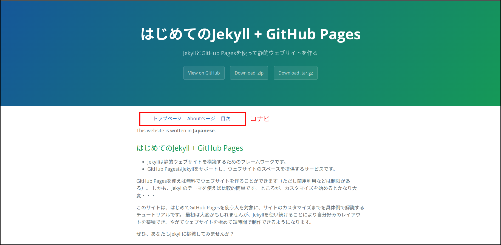

この章ではレイアウトとLiquidの説明をします。

## ファイルの構成と配置

「Jekyll tutorial for beginners」の構成を考えてみます。
このサイトの内容のメインはJekyllのチュートリアル・ドキュメントで、そのファイルが最も多いです。
そこで、ドキュメントを一つのディレクトリの下にまとめることにしました。
ファイルの構成は次のようになります。

- トップページは「index.md」
- Aboutページは「about.md」。サイトの使い方、ライセンスなどを記述する
- チュートリアル・ドキュメントは「ch1.md」「ch2.md」・・・。「\_chapters」ディレクトリの下に配置する
- ドキュメントの目次ページは「toc.md」

ディレクトリ名「\_chapters」の最初にアンダースコア（`_`）がつくのは、Jekyllのコレクションという機能にあわせるためです。

```
+--- _config.yml
+--- index.md
+--- about.md
+--- toc.md
+---_chapters
|       +--- ch1.md
|       +--- ch2.md
|       + ... ... ...
+---assets
|       +--- css
|       +--- images
|       +--- javascript
+---_site
... ... ...
```

このファイル構成はそのまま\_siteのファイル構成になります。
ただし次の2点が異なります。

- 「\_chapters」が\_siteの中では「chapters」になる（先頭のアンダースコアがなくなる）
- ファイル形式が変換される（Markdown＝＞HTML、Scss＝＞Css）。そのため拡張子も変わる

各HTMLファイルには他のページへのリンクが必要です。
リンクはバラバラではなく、まとまって配置するのがユーザ・フレンドリーです。
そこで、コンテンツ内上部に、横並びに設置する方法を取ることにします。
このリンクのことをコンテンツ・ナビゲーション（短くして「コナビ」）と呼ぶことにします。
これは、このチュートリアルの中での呼び方で、一般に使われるものではありません。

コナビはどのページにも使われますので、それらが共有するレイアウトファイルの中に記述することにします。
ただし、default.htmlは変更せずに、その子レイアウトとして「home.html」「chapter.html」を作ります。

## home.html

「index.md」「about.md」「toc.md」の3つのファイルのコナビを記述するレイアウトを「home.html」とします。
\_layoutsフォルダを作り、その下にhome.htmlを置きます。


```html
---
layout: default
---
<ul class="nav">
  <li>
    <a href={{ "/index.html" | relative_url }}>トップページ</a>
  </li>
  <li class="nav">
    <a href={{ "/about.html" | relative_url }}>Aboutページ</a>
  </li>
  <li class="nav">
    <a href={{ "/toc.html" | relative_url }}>目次</a>
  </li>
</ul>
{{ content }}```


フロントマターに`layout: default`があるので、home.htmlはdefault.htmlのコンテンツの部分に表示されます。

各ページへのリンクが順序なしリストになっています。

href=の右のリンク先アドレスはLiquidで書かれています。
`| relative_url`は左から流れ込んだ入力のアドレスに`_config.yml`で指定したBase URLを付け足します。
ここでは、Base URLは`/jekyll-tutorial-for-beginners`です。
最初のリンク先は

```
{{ "/index.html" | relative_url }} => "/jekyll-tutorial-for-beginners/index.html"
```
となります。
relative\_urlが必要かどうかは、JekyllソースデータのルートとGitHub上のルートにずれがあるかないかによります。
一般には「relative\_urlフィルターをつけるのが最善」です。

クラス`nav`はスタイルシート・ファイル「style.scss」で定義されています。
「style.scss」は`/assets/css`フォルダに置きます。


```css
---
---

@import "{{ site.theme }}";

ul.nav {
  display: flex;
}
li.nav{
  list-style: none;
  margin-left: 20px;
}
```


（注意）このファイルの内容はcssと変わりませんが、インポートするファイルがscssなので、拡張子はscssにします。

インポートするファイル名がLiquidのオブジェクト`site.theme`になっています。
`site.theme`の値は`_config.yml`で設定したthemeキーの値で、「jekyll-theme-cayman」です。
同名のScssファイルがCaymanテーマの`_saas`ディレクトリの中に置かれています。

「index.md」「about.md」「toc.md」のフロントマターのレイアウト設定をdefaultからhomeに変更します。
ここまでで、index.mdを表示するとコンテンツの最初に3つのリンクが横並びに表示されます。



## コレクション

Jekyllにはコレクションという機能があります。
コレクションはページ（またはそのページを生成する元ファイル）を整理し、管理できるようにします。

例えば「ch1.md」「ch2.md」・・・は「チュートリアルの章」という括りでまとめられます。
これらを「\_chapters」ディレクトリの下に入れることにより、他のファイルと区別できます。
全体としてもより整理され、分かりやすくなります。
そしてコレクションは`_config.yml`の中で定義します。
コレクション名はディレクトリ名から先頭のアンダースコアを取ったものになります。

```yaml
collections:
  chapters:
    output: true
```

- コレクションは「collections」をキーとするハッシュで表す
- この例では「chapters」がコレクション名で、更にその属性がハッシュで表される
- 「chapters」はLiquidから参照できる。
それは配列で、その要素はディレクトリ内のファイルを表すページ・オブジェクトである。
- デフォルトではコレクションは出力されない。「output: true」は、それを出力されるように変更する

※　Jekyllのver4からは「sort_by」オプションが導入され、コレクションの要素の並び順を定義できます。
例えば「sort_by: chap」とすると章の番号（各ドキュメントのフロントマター要素）で昇順にソートされます。
しかし、現時点（2022/8/23）のGitHubのJekyllのバージョンが3.9.2であり、sort_byはサポート外です。
そこでこのチュートリアルでもsort_byを使っていません。

この定義により、Liquidのタグなどで`site.chapters`が「chaptersコレクション」を表すようになります。
例えば、次のプログラムでは、各章のタイトルが出力されます。
forはLiquidのコマンドです。第9章に説明があります。


```html

  {{ p.title }}

```


## ドキュメントのレイアウト

ドキュメントではコナビに「前の章」「次の章」を加えます。
また、コナビはコンテンツの最初と最後につけることにします。
2箇所に同じコナビをつけるので、コナビを独立したファイルにし、レイアウトの中でインクルードします。

### インクルード

インクルード対象のファイルは「\_include」ディレクトリに置きます。

コナビを表すパーツは下記のリストのようになり、`_include/doc_nav.html`に保存されます。


```
<ul class="nav">
  <li>
    <a href={{ "/index.html" | relative_url }}>トップページ</a>
  </li>
  <li class="nav">
    <a href={{ "/about.html" | relative_url }}>Aboutページ</a>
  </li>
  <li class="nav">
    <a href={{ "/toc.html" | relative_url }}>目次</a>
  </li>
  
    <li class="nav">
      <a href="ch{{page.chap|minus: 1}}.html">前の章</a>
    </li>
  
  
    <li class="nav">
      <a href="ch{{page.chap|plus: 1}}.html">次の章</a>
    </li>
  
</ul>
```


上から10行までは`home.html`と同じです。
``で囲まれたものはLiquidのタグと呼ばれます。
ここにはプログラムのコントロール・フロー（if, else, unlessなどの条件分岐）などを書くことができます。


```

  <li class="nav">
    <a href="ch{{page.chap|minus: 1}}.html">前の章</a>
  </li>

```


ifの条件は「そのページの章（chap）が1より大きい」すなわち「第2章以降」で、このときは「前の章」が存在します。
条件が成立する時にifとendifで囲まれた部分が出力されますが、その出力内容は「前の章へのリンク」です。

例えば第3章の前は第2章で、ファイル名は「ch2.html」（変換後なので拡張子は.mdではない）になります。
数字の2にあたる部分はLiquidのオブジェクト（`{{`と`}}`で囲まれた部分）で表されています。


```
{{page.chap|minus: 1}}
```


縦棒`|`は前にも出てきた「フィルター」で、左の出力を右の入力につなげます。
このときフィルターの動作はパイプの右側に記述します。
「minus」は引き算のフィルターです。
例えば第3章では「page.chap」は3なので、「minus: 1」はそこから1を引き、2になります。

Liquidには算術演算子がありません。
計算にはフィルターを使います。


```

  <li class="nav">
    <a href="ch{{page.chap|plus: 1}}.html">次の章</a>
  </li>

```


ほとんど同じですが、`site.chapters.size`のところが新たな内容です。
変数`site`にコレクション名をつけ、更に`size`をつけています。

- `site.chapters`はchaptersコレクションに属するページの配列を返す
- `size`は文字列の文字数や配列の要素数を返す。
本来パイプ（`|`）とともに使われるフィルターだが、
タグ（``で囲まれた部分）では、ドット（`.`）記法が使える。

章の数が配列のサイズより小さい、すなわち「最後の章ではない」ときに「次の章」をコナビに入れます。

### ドキュメントのレイアウト

ドキュメントのレイアウトは`chapter.html`です。


```html
---
layout: default
---

<h1>第{{page.chap}}章　{{page.title}}</h1>
{{ content }}

```


前に作った`doc_nav.html`を2ヶ所でインクルードしています。
インクルードのおかげで短くさっぱりした記述になっています。
コナビとコンテンツの間に「第何章」というタイトルをh1タグで入れました。

## ドキュメント

ドキュメントのフロントマターにはchapを入れます。
例えば、第1章のドキュメントのフロントマターは次のようになります。

```
---
layout: chapter
title: Jekyll、GitHub Pagesとは
description: JekyllとHitHub Pagesの基礎知識
chap: 1
---
```

- レイアウトはchapter.htmlを使う
- タイトルとディスクリプションを指定＝＞default.html（chapter.htmlの親レイアウト）で使われる
- chapは章の番号を表す＝＞chapter.htmlで使われる

## 目次

目次の生成にはforループを使います。
以下は`toc.md`のソースコードです。


```
---
layout: home
title: 目次
description: チュートリアルの目次
---
## 目次



- [{{doc.chap}}章　{{ doc.title | escape }}]({{ doc.url | relative_url }})

```


下4行が目次を生成する部分です。

- `site.chapters`はchaptersコレクションに含まれるページの配列。
この配列を章の番号順に並ぶように、chapをキーとしてソートし、変数chapsに代入する
- for文は変数docに次々と配列要素を入れてループする
- `{{doc.chap}}`はそのページの章番号になる
- `{{doc.title}}`はそのページのタイトル
- `{{doc.url}}`はそのページのURLアドレスになる

このようにして、各章へのリンクがMarkdownのリストとして生成されます。

このウェブサイト「はじめてのJekyll + GitHub Pages」はこの章で説明したプログラムを使っています。
ぜひレポジトリをクローンしてレイアウトやドキュメント、目次のソースファイルを読んでください。
より一層理解を深めることができると思います。