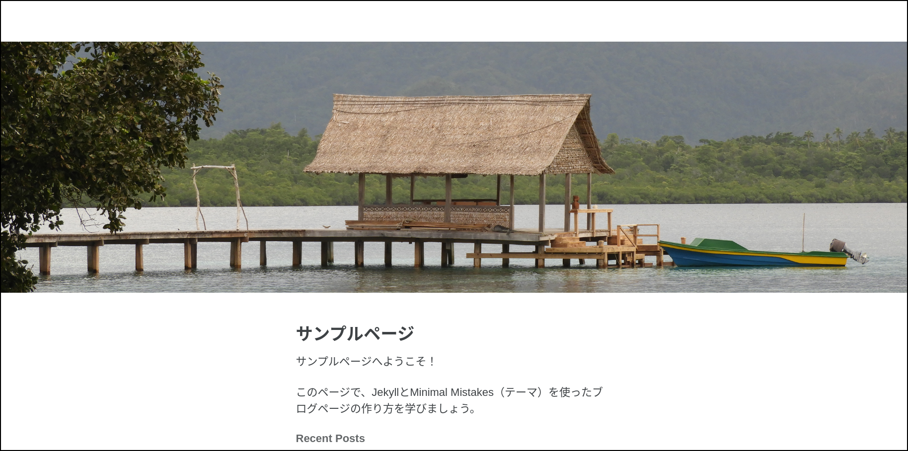
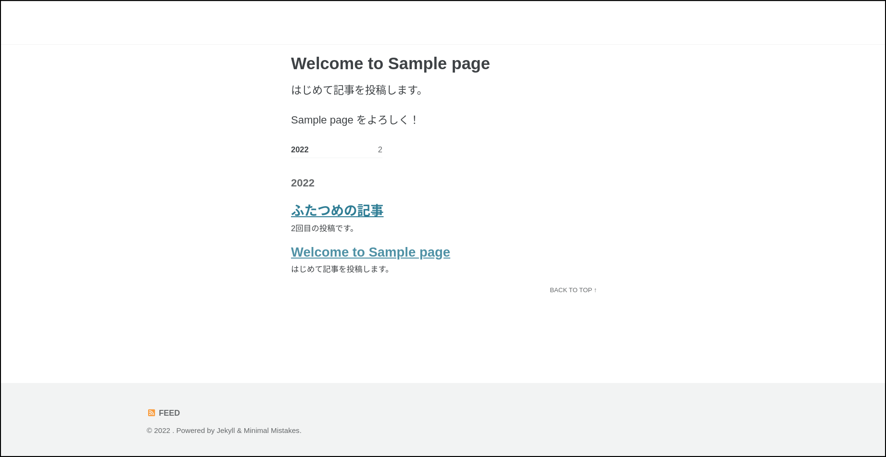

## Minimal Mistakes

Jekyllでブログを始めるなら、ブログをサポートしているテーマを使うのが良い方法です。
ちなみにCaymanはブログをサポートしていません。

Jekyllのテーマを探すには、Jekyllのウェブサイトの[Resources](https://jekyllrb.com/resources/)を見てください。
そこにたくさんのテーマへのリンクが貼られています。

ここでは、その中からMinimal Mistakes使い、ブログを作ってみます。
なお、ここではローカルで動かします。

もし、あなたがMinimal MistakesをGitHubで使おうとしても、今までの方法だけではうまくいきません。
Minimal MistakesはCaymanと違い、GitHubがその内部にgemを持っていないので、\_config.ymlにテーマ名を書くだけでは動かないのです。
テーマそのものをレポジトリに含めるか、リモートでテーマを設定することが必要です。
詳しくは、[Minimal Mistakesのドキュメント](https://mmistakes.github.io/minimal-mistakes/docs/quick-start-guide/)を参考にしてください。

## インストール

ブログ用のディレクトリを作ります。
ここでは「sample」という名前にします。

```
$ mkdir sample
$ cd sample
```

Gemfileを作ります。

```ruby
source "https://rubygems.org"

gem "minimal-mistakes-jekyll"
gem "webrick"
```

\_cofig.ymlを作ります

```yaml
   theme: minimal-mistakes-jekyll
```

gemをインストールします。

```
$ bundle install
```

以上でインストールは完了です。

## index.mdを作る

トップページの名前は「index.md」と決まっています。
簡単なメッセージを書いておくことにします。

```markdown
---
layout: home
title: サンプルページ
description: 練習用のサンプルページ
header:
  image: "/assets/images/home.png"
---

サンプルページへようこそ！

このページで、JekyllとMinimal Mistakes（テーマ）を使ったブログページの作り方を学びましょう。
```

- レイアウトはhomeにする
- titleとdescriptionを書く
- ページを少しお洒落にするためにタイトルのヘッダに写真を入れる。
headerキーの下にimageキーで画像の場所を指定する

タイトル画面の画像を設定するyamlはMinimal Mistakesのソースコード（レイアウトとインクルード）から把握することができます。
[ドキュメント](https://mmistakes.github.io/minimal-mistakes/docs/configuration/#open-graph-default-image)にも短い記述がありますが、分かりにくいと思います。

それでは、画面をチェックしましょう。

```
$ bundle exec jekyll serve
```

ブラウザでlocalhost:4000を開きます。



写真が入るとイメージが良くなりますね。

## 記事の投稿

ブログの投稿記事は日時で順番付けられます。
日時はファイル名とフロントマターの2ヶ所に書きます。

```markdown
---
layout: posts
title:  "Welcome to Sample page"
description: "The first post to Sample page"
date:   2022-0８-20 14:05:00 +0900
---

はじめて記事を投稿します。

Sample page をよろしく！
```

- layoutは「posts」にする。これはMinimal Mistakesの仕様。minimaでは「post」と単数形
- タイトルとディスクリプションを書く
- dateに日時を書く。フォーマットはYYYY-MM-DD HH:MM:SS +900。最後の+900はTokyoの標準時からの時差
- ファイル名は`2022-08-20-welcome-to-Sample-pagei.md`とした。「日付-タイトル.md」のフォーマット

もう一つ記事を作ってみます。

```markdown
---
layout: posts
title:  ふたつめの記事
description: この記事が投稿2回目
date:   2022-0８4-20 14:15:00 +0900
---

2回目の投稿です。

Sample page をもっともっとよろしく！
```

ファイル名は`2022-08-20-The-second-post.md`としました。
全角文字を使ってもたぶん良いと思います。



このように、ブログの仕組みがテーマに用意されていれば、記事の投稿は簡単です。
今回使ったMinimal Mistakeは洗練されたデザインで機能も豊富です。
実用的な価値がありそうだと思いました。

## ブログの仕組みを一から作る方法

テーマがブログをサポートしているとは限りません。
例えばCaymanがそうです。
ブログ機能が無ければ一から自分で作らなければなりません。
といっても、それは大変な作業ではありません。
デフォルトのテーマminimaがブログをサポートしているので、それを参考に作るのが早いです。

- `_posts`ディレクトリをつくる＝＞ブログ記事を入れるディレクトリ
- `_layouts`ディレクトリの中にブログ用のレイアウトを作る＝＞`post.html`の名前で保存
- ホーム用のレイアウト`home.html`にブログのリストを載せる場合は、パジネーション（pagination）を導入する

このうち、レイアウトの作成がメインの仕事になります。
ここでは詳細に立ち入ることはしません。
minimaのソースコードを参考にしてください。
