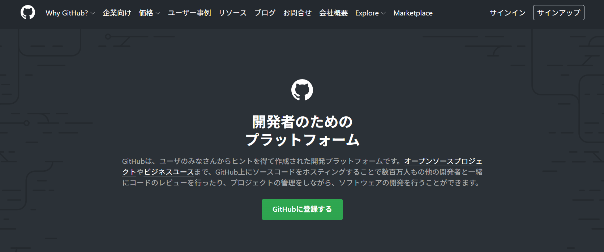
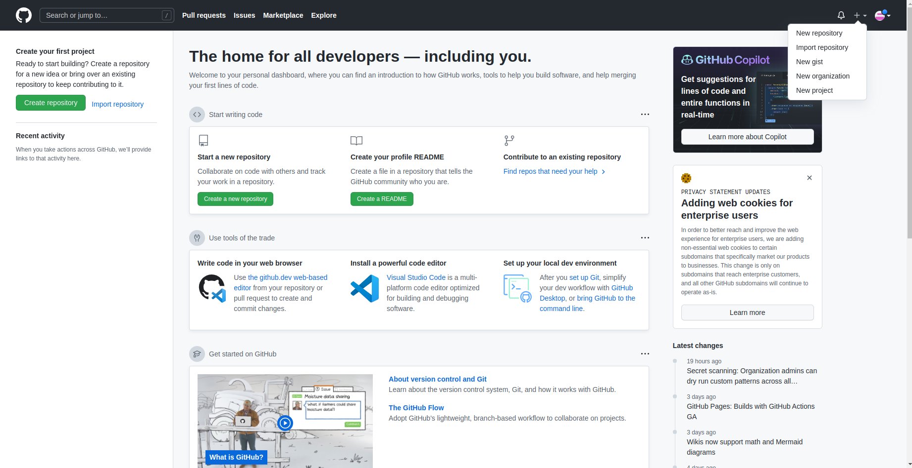
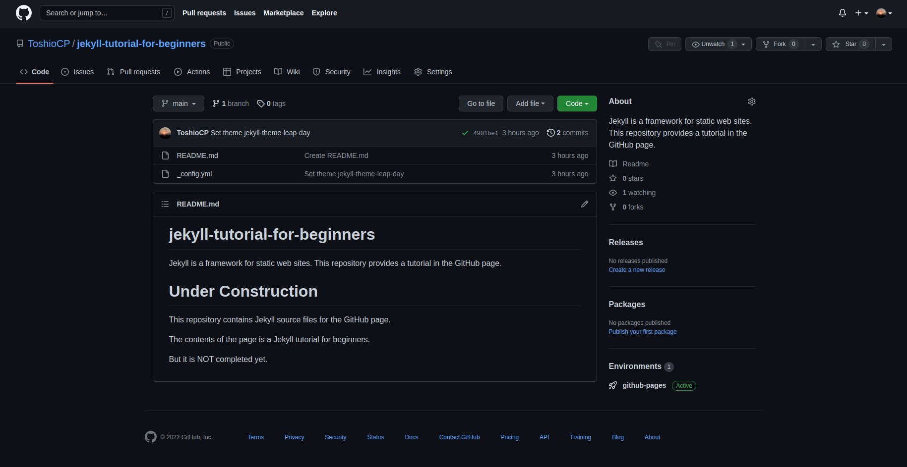

この章ではGitHub Pagesでウェブサイトを作ります。
一見Jekyllから離れてしまうように思うかもしれませんが、実はそうではありません。
GitHub Pagesでウェブサイトを作るとき、背後でJekyllが動いているのです。
もちろん、Jekyllを使わなくてもGitHub pagesでウェブサイトは作ることはできますが、ここではその話題は扱いません。

## GitHubのアカウントの作成

すでにアカウントを持っている方はこの部分を飛ばしてください。
以下は、2022年8月13日現在の方法で、細かいところは今後変わる可能性があります。

- ブラウザでGitHub（<httpd://github.com/>）にアクセスする。



- 「Sign up」ボタン（右上の方）をクリックする。
- 以下、いくつかの項目の入力を要求されるので「入力＝＞「continue」ボタンをクリック」を繰り返す。
- 登録したメールアドレスにメールが届く。
そこに数字が並んでいる。
それをウェブページに入力することで最終的な本人確認が終わり、アカウントが作成される。

## レポジトリを作成する

GitHubにレポジトリ（gitレポジトリ）を作成します。
今回はローカル（自分のパソコンのこと）にレポジトリを用意せず、GitHub上に直接作っていきます。



- GitHubのページを開き、右上の「+」ボタンをクリックし、ポップアップ・メニューから「New Repository」を選ぶ
- レポジトリ名は何でも良い。ただし英語（半角文字）でスペースはハイフンに直す。これから作るウェブページに相応しいものを自分で決める。
- ディスクリプションはウェブページの簡単な説明書きのこと。
書かなくても良いが、一般的には書いておくのが良い。
- GitHub Pagesを使うときは「公開（public）」しか選べない。
有料のコースを選べば「非公開（private）」を選ぶこともできる。
ここでは「公開」のままで良いでしょう。
- 初期化のところでは、「Add a README file」のところはチェックしておくのが良い。
何もチェックしないとレポジトリの中身が何もない状態なのでGitHub Pagesの作成ができない。
- 「.gitignore」と「license」はチェックしなくても良い。
チェックするとその後でファイルの内容を入力しなければならなくなり、あらかじめ用意していないと作業が止まってしまう可能性がある。
- 「Create Repository」ボタンをクリックすると、README.mdファイルの編集画面になる。
この内容が、レポジトリのトップ画面で表示される。
このファイルには、通常レポジトリの説明を書く。
下の方の「Commit changes」（緑色のボタン）をクリックするとREADME.mdファイルが作成される。

コミットはgitを知っている方ならその「コミット」のことです。
Gitは後の章で説明します。

README.mdの例

```markdown
# 〇〇のウェブサイト

これは〇〇のブログ・サイトです。
はじめたばかりなので記事がまだありませんが、どうぞよろしく。
```

こんなお粗末なものを書く人はいないだろうと思いますが、これでも公開はできます。

作業が終わると、レポジトリが表示されます。
ちなみに、今私が作り始めたレポジトリはこんな感じです。
背景が黒いのは、私がそのように設定したからで、初期設定は背景が白です。



## GitHub Pages の設定

レポジトリ名（青色の文字列）の下にメニューが並んでいます。
一番左は「&lt;> code」、一番右が「Settings」です。

- 「Settings」をクリック
- 画面左に縦に並んでいるメニューの中程「Pages」をクリック
- 右側のメインのカラムの中程、「Branch」のところをクリックして「main」を選択、次のところは「root」を選択する

この段階でGitHub Pagesの作成が開始されます。
作成にはおよそ2分かかり、その過程でJekyllが使われます。

README.mdがHTMLに変換されてページに現れているはずですので、右上の「visit site」ボタンをクリックして確認してください。

## テーマを選ぶ

GitHubで設定する「テーマ」は「Jekyllのテーマ」のことです。
Jekyllで一からサイトを構築することもできますが、テーマを使うとそのかなりの手間を省くことができます。

「Settings」の「Page」メニューを開きます。
ブランチの選択の下にテーマの選択（Theme Chooser）のボタン「Change Theme」があります。
それをクリックします。
2022/8/13の時点では、「Cayman」から「Leap Day」までのテーマが表示されています。
そのうちの気に入ったテーマをクリックし、「Select theme」（テーマを選択、緑色）ボタンをクリックします。

レポジトリ名（青色の文字列）の下のメニューから、「&lt;> code」（一番左）をクリックします。
すると、コードに「_config.yml」が追加されています。

私は「Leao day」を選んでみました。
「\_config.yml」をクリックします。

```
theme: jekyll-theme-leap-day
```

あなたが他のテーマを選んだのであれば、ここにはそのテーマが書かれているはずです。

## ウェブページの確認

ウェブページは`https://（ユーザ名）.github.io/（レポジトリ名）/`となっています。
ブラウザからアクセスしてみてください。
ちなみに私のサイトは、現時点では次のようになっています。


README.mdの内容がトップページに反映されていることが分かります。
また、テーマのスタイルシートのおかげで、良い感じのデザインになっています。

このあと、タイトルを日本語にしたり、チュートリアルの内容を付け足したりしてサイトを構築していきます。

いかがでしょうか？
このようにしてGitHubで無料でホームページを作ることができます。
ただし、商用利用などはできないことになっています。
詳しくはGitHubの利用規約を確認してください。
