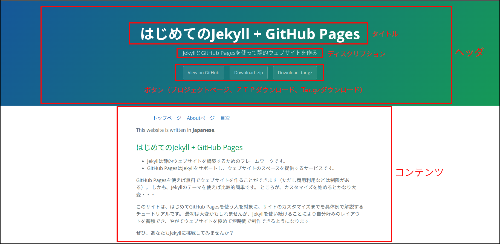

この章では、Leap-dayテーマのレイアウトを説明します。
ここでLeap-dayを使うのは、あくまでテーマの一例としてです。
他のテーマを使う場合にも応用がきくように、レイアウトの仕組みも説明します。

以下の説明では、`index.md`（サイトの入口にあたるページ）を新たに作成し、そのファイルとレイアウトの関連を見ていきます。 

## レイアウトファイルの置き場

Jekyllではレイアウトファイルの置き場は`/_layouts`です。
ただし、最初のスラッシュはJekyllのソースファイルのトップディレクトリです。
Linuxのルートディレクトリではないので注意してください。

Leap-dayテーマはgemで提供されているので、そのレイアウトはgemがおかれている場所の`_layouts`ディレクトリになります。

```
$ bundle info jekyll-theme-leap-day
  * jekyll-theme-leap-day (0.2.0)
	Summary: Leap Day is a Jekyll theme for GitHub Pages
	Homepage: https://github.com/pages-themes/leap-day
	Path: （ここにそのPCにおけるjekyll-theme-leap-day-0.2.0のパスが表示される）
	Reverse Dependencies: 
		github-pages (227) depends on jekyll-theme-leap-day (= 0.2.0)
```

そのディレクトリの`default.html`というファイルがleap-dayのレイアウトを記述したファイルになります。
`default.html`はHTMLファイルですが、Liquidの記述も多く含まれています。

## レイアウトの構成

Leap-dayは次のようなレイアウト構成になっています。



- 上の青い部分が「ヘッダ」で、その中に「タイトル」「ディスクリプション」がある
- 黄色い部分が「バナー」でアイコンが並んでいる
- 左側の部分が「ナビゲーション」で、本文の見出しへのリンクが設置されている。
なお、この部分はJavascriptで動的に生成されています。
- 中央の白い部分が「コンテンツ」

個々のファイルで変更できるのは「タイトル」「ディスクリプション」「コンテンツ」です。
また、「ナビゲーション」の部分はコンテンツの見出しが自動的に反映されます。

#### タイトルとディスクリプション

タイトルとディスクリプションは`default.html`の20から23行目で記述されています。


```html
<header>
  <h1>{{ page.title | default: site.title | default: site.github.repository_name }}</h1>
  <p>{{ page.description | default: site.description | default: site.github.project_tagline }}</p>
</header>
```


HTMLに埋め込まれている`{{`と`}}`で囲まれている部分はLiquidという一種のプログラミング言語です。
[LiquidのGItHubページ](https://github.com/Shopify/liquid)では、これを「テンプレート・エンジン」と呼んでいます。
`h1`タグのところがタイトルです。

```
page.title | default: site.title | default: site.github.repository_name
```

- `page.title`はページのタイトル。
例えば、index.mdのフロントマターに`title: インデックスページ`と書かれていたとすると、その文字列「インデックスページ」が`page.title`に代入される。
それがなくて、コンテンツの最初が見出しの場合は、その見出しが`page.title`に代入される。
ページのタイトルがなければ、nilが代入される。
- `site.title`はサイトのタイトル。
例えば、`_config.yml`に`title: サンプルサイト`と書かれていたとすると、「サンプルサイト」が`site.title`に代入される。
- `site.github.repository_name`はGitHubのレポジトリーの名前。
ローカルでJekyllを動かすときには、手元にGitHubレポジトリーの情報がない。
情報は`jekyll-github-metadata` gemがGitHubに問い合わせて取得する。
- 縦棒`|`はフィルターと呼ばれているLiquidの構文で、左の式の値が右への入力になる。
これはBashのパイプと似た機能である。
縦棒を「パイプ」ともいう。
また、左側の出力と右側の入力をつなげる機能も「パイプ」という。
「左側の出力がパイプを通って右側の入力になる」というような表現をする。
- `default:` はフィルターの動作を規定するコマンドで、入力が空文字列、nil、falseのいずれかであればデフォルト値（`default:`の次に書かれている式）をとる。
それ以外はパイプから入力された式を値とする。

これよりこのLiquidのフィルタは

- ページタイトルがあればページタイトルを出力
- ページタイトルがなくてサイトタイトルがあれば、サイトタイトルを出力
- ページタイトルもサイトタイトルもなければ、GitHubレポジトリ名を出力

となります。
同様にディスクリプションのところも

- ページディスクリプションがあればページディスクリプションを出力
- ページディスクリプションが無くてサイトディスクリプションがあれば、サイトディスクリプションを出力
- ページディスクリプションもサイトディスクリプションもなければ、GitHubレポジトリのディスクリプション（レポジトリのAboutに書かれている文章）を出力

となります。

index.mdのフロントマターには、原則としてタイトルとディスクリプションを記述するのが望ましいです。

タイトルやディスクリプションを書いたフロントマターの例：

```
---
layout: default
title: はじめてのJekyll + GitHub Pages
description: JekyllとGitHub Pagesを使って静的ウェブサイトを作る
---
```

- 3つの`-`の行で囲まれた部分はフロント・マター（書物の前付--書籍の本文の前に入れる序文、目次などの総称）という。
そこには、yaml形式でそのファイルの情報を書く。
「キー: 値」はハッシュ（連想配列）を表す。
区切りにはコロン（`:`）と半角空白を入れる。
空白は省略できない。
- 「layout」はその文書のレイアウトを表すファイルを指す。
- 「title」はこの記事のタイトルで、レイアウトによって使われる。

フロントマターが無いファイルについてはJekyllは何もせずにそのまま出力ページにコピーします。
フロントマターに記述する内容が無くても、MarkdownをHTMLにしたければフロントマターが必要です。
その際は、`---`を2行書いておくだけで大丈夫です。

#### コンテンツ

コンテンツはindex.mdのフロントマターを除いた本体部分です。
拡張子が「.md」なので、Markdownで記述します。
この部分でもLiquidが使えます。
今回はLiquidを使いませんが、後の章で説明する機会があると思います。

index.mdの参考例：

```
---
layout: default
title: はじめてのJekyll + GitHub Pages
description: JekyllとGitHub Pagesを使って静的ウェブサイトを作る
---

# はじめてのJekyll + GitHub Pages

## Written in Japanese

This website is written in **Japanese**.

## このウェブサイトは未完成です

現在、このウェブサイトは作成途中にあります。
書かれている内容も十分吟味されておりませんし、変更も多々あります。
完成までしばらくお待ちください。

## はじめてのJekyll + GitHub Pages

Jekyllは静的ウェブサイトを構築するためのフレームワークです。
また、GitHub PagesはJekyllをサポートし、ウェブサイトのスペースを提供するサービスです。

このウェブサイトは、GitHub Pagesでウェブサイトを作るためのチュートリアルです。

- [目次](toc.html)
- [Aboutページ](about.html)
```

コンテンツはレイアウトの`content`のところに代入されます。
Leap-dayのレイアウト`default.html`の45行目に`content`があります。


```
{{ content }}
```


二重のブレース`{{`と`}}`はLiquidの構文を囲むもので、その値に置き換わります。
`content`はindex.mdのフロントマターを除いた部分がHTMLに変換されたものが値になります。

## サイトタイトルとサイトディスクリプション

サイトタイトルとサイトディスクリプションは`_config.yml`に書きます。

サイトディスクリプションの例：

```yaml
theme: jekyll-theme-leap-day

title: はじめてのJekyll + GitHub Pages
description: JekyllとGitHub Pagesを使って静的ウェブサイトを作る

exclude:
  - README.md
```

最後に`exclude`がありますが、これはリスト（配列）を値にとり、そのファイルをJekyllの出力生成から除きます。
index.htmlがサイトの入口になったので、README.mdは出力する必要がなくなりました。
README.mdはレポジトリーの説明だけのために残します。

ここで、yamlのリストの書き方について簡単に触れておきましょう。
詳しい説明は[yamlのウェブサイト](https://yaml.org/spec/1.2.2/)にあります。

リストは`-`と半角空白で表します。
たとえば

```
- abc
- def
- ghi
```

は3つの要素からなるリストです。
`-`の後の半角空白を省略することはできません。
このリストはRubyのデータ構造では配列になります。

```ruby
[ "abc", "def", "ghi" ]
```

と同じことです。
\_config.ymlでは、ハッシュ「exclude」の値がリストになっています。
そのときは、リストはハッシュに対してインデント（半角空白で字下げ）をしなければなりません。
このときタブを用いることはできず、かならず半角空白を用います。
空白の字数は1つ以上であればいくつでも構いませんが、見やすさの点から2文字程度にするのが一般的です。
また、リストが複数ある場合はインデントの深さは揃えなければなりません。

\_config.ymlをRubyのデータ構造で表すと、

```ruby
{ "theme" => "jekyll-theme-leap-day" }
{ "title" => "はじめてのJekyll + GitHub Pages" }
{ "description" => "JekyllとGitHub Pagesを使って静的ウェブサイトを作る" }
{ "exclude" => [ " README.md" ] }
```

となります。

## Jekyllでテスト

Jekyllを動かしてテストしてみましょう。

```
$ bundle exec jekyll serve
```

ここでブラウザを立ち上げ、「`localhost:4000`」を開きます。


- 最上段のタイトルとディスクリプションは、フロントマターのタイトル、ディスクリプションがコピーされている
- コンテンツの部分は白い背景になっている中央部分に表示されている
- コンテンツ左のナビゲーションにはMakdownの見出しへのリンクが自動的に設置されている

Jekyllによる開発で最も時間がかかるのは、レイアウトの作成です。
それは単にdefault.htmlを書くだけでなく、

- CSS + レスポンシブデザイン
- Javascript
- その他

が含まれます。
その他にはサイトのファイル構成なども関わります。

テーマを使うとレイアウトが既にできあがっているので、開発の負担が非常に軽くなります。
残っているのはコンテンツを加えることだけです。
これはマークダウンさえ書ければ、誰でもできます。

### \_siteディレクトリ

ローカル・レポジトリを再確認すると、新しいディレクトリ「\_site」ができています。

```
$ tree
.
├── Gemfile
├── Gemfile.lock
├── README.md
├── _config.yml
├── _site
│   ├── assets
│   │   ├── css
... ... ...
... ... ...
│   └── index.html
└── index.md
```

「\_site」ディレクトリはJekyllによって生成されたものです。
この生成のタイミングは

- 「bundle exec jekyll serve」の直後、サービスが動いている間は、index.mdなどのファイル（\_config.ymlを除く）が更新されるごと 
- 「bundle exec jekyll build」で\_siteを生成するとき

です。
生成時には、まず「\_site」の中身を全て削除してから生成します。
うっかりして「\_site」の中にファイルを作ったりすると、生成時に失くなってしまいます。

ブラウザには「\_site」の中身が表示されます。
つまり、このディレクトリがウェブサービスのページを格納しているディレクトリなのです。
Jekyllは「レポジトリのファイルからページを組み立ててこのディレクトリに書き出す」ということをしていたわけです。

もし、レンタル・サーバーなどのウェブスペースを持っている場合は、この中身をアップロードすればウェブページが公開できます。