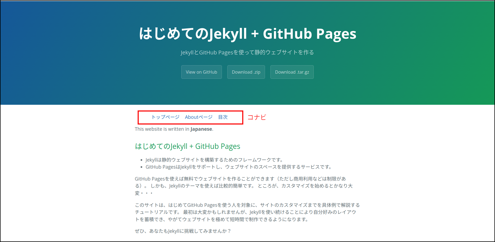

この章ではレイアウトとLiquidの説明をします。

## ファイルの構成と配置

「Jekyll tutorial for beginners」の構成を考えてみます。
このサイトのメインはドキュメントで、そのファイルが最も多いです。
そこで、ドキュメントを一つのディレクトリの下にまとめることにしました。
ファイルの構成は次のようになります。

- トップページは「index.md」
- Aboutページは「about.md」。サイトの使い方、ライセンスなどを記述する
- チュートリアル・ドキュメントは「doc1.md」「doc2.md」・・・。「\_documents」ディレクトリの下に配置する
- ドキュメントの目次ページは「toc.md」

ディレクトリ名の最初にアンダースコア（`_`）がつくのは、Jekyllのコレクションという機能にあわせるためです。

```
+--- _config.yml
+--- index.md
+--- about.md
+--- toc.md
+---_documents
|       +--- doc1.md
|       +--- doc2.md
|       + ... ... ...
+---assets
|       +--- css
|       +--- images
|       +--- javascript
+---_site
... ... ...
```

このファイル構成はそのまま\_siteのファイル構成になります。
ただし、Markdown＝＞HTML、Scss＝＞Cssとファイル形式は変換されます。

各HTMLファイルには他のページへのリンクが必要です。
リンクはバラバラではなく、まとまって配置するのがユーザ・フレンドリーです。
そこで、コンテンツ内上部に、横並びに設置する方法を取ることにします。
このリンクのことをコンテンツ・ナビゲーション（短くして「コナビ」）と呼ぶことにします。
これは、このブログの中での呼び方で、一般に使われるものではありません。

コナビはどのページにも使われますので、それらが共有するレイアウトファイルの中に記述することにします。
ただし、default.htmlは変更せずに、その子レイアウトとして「home.html」「document.html」を作ります。

## home.html

「index.md」「about.md」「toc.md」の3つのファイルのコナビを記述するレイアウトを「home.html」とします。
\_layoutsフォルダを作り、その下にhome.htmlを置きます。


```html
---
layout: default
---
<ul class="nav">
  <li class="nav">
    <a href="/index.html">トップページ</a>
  </li>
  <li class="nav">
    <a href="/about.html">Aboutページ</a>
  </li>
  <li class="nav">
    <a href="/toc.html">目次</a>
  </li>
</ul>
{{ content }}
```


フロントマターに`layout: default`があるので、home.htmlはdefault.htmlのコンテンツの部分に表示されます。

各ページへのリンクが順序なしリストになっています。

クラス`nav`はスタイルシート・ファイル「style.scss」で定義されています。
このファイルは`assets/css`フォルダに置きます。


```css
---
---

@import "{{ site.theme }}";

ul.nav {
  display: flex;
}
li.nav{
  list-style: none;
  margin-left: 20px;
}
```


（注意）このファイルの内容はcssと変わりませんが、インポートするファイルがscssなので、拡張子はscssにします。

インポートするファイル名がLiquidのオブジェクト`site.theme`になっています。
これは`_config.yml`で設定したthemeキーの値で、「jekyll-theme-leap-day」です。
同名のScssファイルがLeap-dayテーマの中に設定されています。

「index.md」「about.md」「toc.md」のフロントマターのレイアウト設定をdefaultからhomeに変更します。
ここまでで、index.mdを表示するとコンテンツの最初に3つのリンクが横並びに表示されます。



## コレクション

Jekyllにはコレクションという機能があります。
コレクションはページ（またはそのページを生成するファイル）を整理し、管理できるようにします。

例えば「doc1.md」「doc2.md」・・・は「チュートリアルのドキュメント」という括りでまとめられます。
これらを「\_documents」ディレクトリの下に入れることにより、他のファイルと区別でき、ルートディレクトリもすっきりします。
そしてコレクションは`_config.yml`の中で定義します。
コレクション名はディレクトリ名から先頭のアンダースコアを取ったものになります。

```yaml
collections:
  documents:
    output: true
    sort_by: chap
```

- コレクションは「collections」をキーとするハッシュで表す
- この例では「documents」がコレクション名で、更にその属性がハッシュで表される
- デフォルトではコレクションは出力されないので「output: true」で出力されるようにする
- 「sort_by」は、コレクション内のページの配列を生成するときの並び順を定義する。
「chap」は章の番号で、各ドキュメントファイルのフロントマターで定義する

この定義により、Liquidのタグなどで`site.documents`が「documentsコレクション」を表すようになります。

## ドキュメントのレイアウト

ドキュメントではコナビに「前の章」「次の章」を加えます。
また、コナビはコンテンツの最初と最後につけることにします。
2箇所に同じコナビをつけるので、コナビを独立したファイルにし、レイアウトの中でインクルードします。

### インクルード

インクルード対象のファイルは「\_include」ディレクトリに置きます。

コナビを表すパーツは下記のリストのようになり、`_include/doc_nav.html`に保存されます。


```
<ul class="nav">
  <li class="nav">
    <a href="/index.html">トップページ</a>
  </li>
  <li class="nav">
    <a href="/about.html">Aboutページ</a>
  </li>
  <li class="nav">
    <a href="/toc.html">目次</a>
  </li>
  
    <li class="nav">
      <a href="doc{{page.chap|minus: 1}}.html">{{chap}}前の章</a>
    </li>
  
  
    <li class="nav">
      <a href="doc{{page.chap|plus: 1}}.html">次の章</a>
    </li>
  
</ul>
```


上から10行までは`home.html`のレイアウトに書いた内容と同じです。
``で囲まれたものはLiquidのタグと呼ばれます。
ここにはプログラムのコントロール・フロー（if, else, unlessなどの条件分岐）などを書くことができます。


```html

  <li class="nav">
    <a href="doc{{page.chap|minus: 1}}.html">{{chap}}前の章</a>
  </li>

```


ifの条件は「そのページの章（chap）が1より大きい」すなわち「第2章以降」で、このときは「前の章」が存在します。
条件が成立する時にifとendifで囲まれた部分が出力されますが、その出力内容は「前の章へのリンク」です。

例えば第3章の前は第2章で、ファイル名は「doc2.html」（変換後なので拡張子は.mdではない）になります。
数字の2にあたる部分はLiquidのオブジェクト（`{{`と`}}`で囲まれた部分）で表されています。


```
{{page.chap|minus: 1}}
```


縦棒`|`は前にも出てきた「フィルター」で、左の出力を右の入力につなげます。
このときフィルターの動作はパイプの右側に記述します。
「minus」は引き算のフィルターです。
例えば第3章では「page.chap」は3なので、「minus: 1」はそこから1を引き、2になります。

Liquidには算術演算子がありません。
計算にはフィルターを使います。


```

  <li class="nav">
    <a href="doc{{page.chap|plus: 1}}.html">次の章</a>
  </li>

```
{$endraw %}

ほとんど同じですが、`site.documents.size`のところが新たな内容です。
変数`site`にコレクション名をつけ、更に`size`をつけています。

- `site.documents`はdocumentsコレクションに属するページの配列を返す
- `size`は文字列の文字数や配列の要素数を返す。
本来パイプ（`|`）とともに使われるフィルターだが、
タグ（<%raw%}``で囲まれた部分）では、ドット（`.`）記法が使える。

章の数が配列のサイズより小さい、すなわち「最後の章ではない」ときに「次の章」をコナビに入れます。

### ドキュメントのレイアウト

ドキュメントのレイアウトは`document.html`です。


```html
---
layout: default
---

<h1>第{{page.chap}}章　{{page.title}}</h1>
{{ content }}

```


前に作った`doc_nav.html`を2ヶ所でインクルードしています。
インクルードのおかげで短くさっぱりした記述になっています。
コナビとコンテンツの間に「第何章」というタイトルをh1タグで入れました。

## ドキュメント

ドキュメント（doc1.mdなど）のフロントマターにはchapを入れます。
例えば、第1章のドキュメントのフロントマターは次のようになります。

```
---
layout: document
title: Jekyll、GitHub Pagesとは
description: JekyllとHitHub Pagesの基礎知識
chap: 1
---
```

- レイアウトはdocument.htmlを使う
- タイトルとディスクリプションを指定＝＞default.html（document.htmlの親レイアウト）で使われる
- chapは章の番号を表す＝＞document.htmlで使われる

## 目次

目次の生成にはforループを使います。
以下は`toc.md`のソースコードです。


```markdown
---
layout: home
title: 目次
description: チュートリアルの目次
---
## 目次


- [{{doc.chap}}章　{{ doc.title }}]({{ doc.url }})

```


下3行が目次を生成する部分です。

- `site.documents`はdocumentsコレクションに含まれるページの配列。
この配列は章の番号順に並ぶことが`_config.yml`の設定で保証されている
- for文は変数docに次々と配列要素を入れてループする
- `{{doc.chap}}`はそのページの章番号になる
- `{{doc.title}}`はそのページのタイトル
- `{{doc.url}}`はそのページのURLアドレスになる

このようにして、各章へのリンクがMarkdownのリストとして生成されます。

## Leap dayの日本語対応

Leap dayのJavascript（jQuery）は、見出しが日本語のときに上手く動作しません。
修正は、次のようにします。

- `assets/js`ディレクトリを作る
- Leap dayのgemの場所を調べる（`$ bundle info jekyll-theme-leap-day`でパスが表示される）
- Leap dayの`assets/js/main.js`を最初に作った`assets/js`の下にコピーする
- 下記のようにmain.jsを修正する

```javascript
... ... ...
... ... ...
$(window).resize(sectionHeight);

var tag_number = 1;

$(function() {
  $("section h1, section h2, section h3").each(function(){
    $("nav ul").append("<li class='tag-" + this.nodeName.toLowerCase() + "'><a href='#tag_" + String(tag_number) + "'>" + $(this).text() + "</a></li>");
    $(this).attr("id","tag_"+String(tag_number));
    ++tag_number;
    $("nav ul li:first-child a").parent().addClass("active");
  });
});
... ... ...
... ... ...
```

変更箇所は4ヶ所です。

- var tag\_number = 1;
- $(function()から2-3行目のString(tag\_number)に置き換える部分（2ヶ所）
- ++tag\_number

手作業では間違いやすいのでコピペするのが良いと思います。

以上のようにしてできあがったのがこのウェブサイト「はじめてのJekyll + GitHub Pages」です。
サイトのレイアウトとこの章の説明を比べてみてください。
